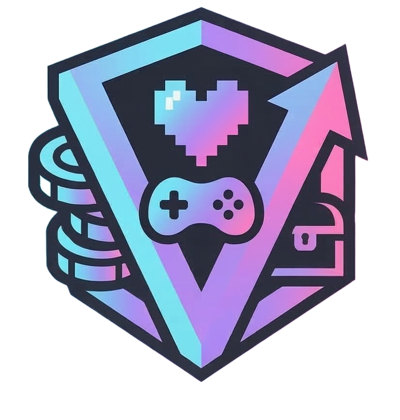

<p align="center">
  
</p>

# GameVault

A self-hosted web-based application to keep track of your physical and digital video game library.

This project is for my Software Capstone Class

---

## Docker Setup
Replace the placeholders with your actual credentials and paths.

```bash
docker run -d \
  --name GameVault \
  -p 8765:80 \
  -v "Your Rom Path Location":/app/roms \
  -e IGDB_CLIENT_ID="your_client_id" \
  -e IGDB_CLIENT_SECRET="your_client_secret" \
  -e RA_USERNAME="your_retroachievements_username" \
  -e RA_WEB_API_KEY="your_retroachievements_web_api_key" \
  -e MYSQL_USER="admin" \
  -e MYSQL_PASSWORD="your_password" \
  -e MYSQL_URL="192.168.1.x" \
  -e MYSQL_PORT="3306" \
  -e MYSQL_DB_NAME="app_database" \
  jholsclaw79/gamevault:main
```

## Made With
* .Net 10
* MudBlazor
* Dracula Theme
* Docker
